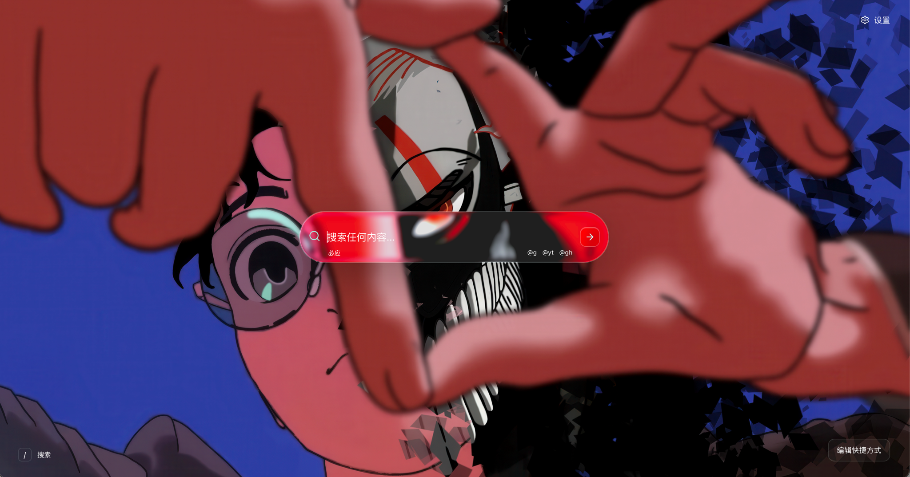

# Liquid New Tab

<p align="center">
  
</p>

Liquid New Tab is a focused Chrome new-tab extension built around one large search lens and a small orbit of the websites you use most.

[Download the latest release](https://github.com/RSK21X/liquid-new-tab/releases/latest)

## Features

- Dark-only liquid-glass interface with a quiet, centered layout.
- Search by clicking the lens or pressing `/`.
- Click outside the expanded search lens, or press `Escape`, to close it.
- Enter a URL to open it directly, or search with the selected engine.
- Use `@g`, `@yt`, and `@gh` to send a query to Google, YouTube, or GitHub.
- Use `>edit` and `>settings` for quick commands.
- Add, remove, and reorder shortcuts around the orbit.
- Reorder shortcuts with arrow keys while editing.
- Load a custom image background locally, or return to the built-in dark glass field.
- Choose English or Chinese from Settings.
- Choose low, normal, or high glass intensity.
- Use a local extension icon and website-owned favicon paths, with Morphicons as the fallback when a site has no usable icon.

## Privacy

The extension is local-first:

- No account is required.
- No analytics or tracking code is included.
- Preferences and shortcuts are stored in Chrome's local extension storage.
- The extension requests only the `storage` permission.
- Custom background images are stored locally in the extension's data.
- Shortcut icons are requested from the shortcut website itself. A site may block its favicon; that does not affect navigation.

## Install from a release

### ZIP — recommended

1. Download `liquid-new-tab-v0.1.0.zip` from the [latest release](https://github.com/RSK21X/liquid-new-tab/releases/latest).
2. Unzip it into a folder that you will keep.
3. Open `chrome://extensions` in Chrome.
4. Turn on **Developer mode**.
5. Click **Load unpacked** and select the unzipped folder.

### CRX — optional

The release also includes a `.crx` package. Chrome may block direct installation of CRX files downloaded from the internet, depending on the browser and operating system. If Chrome rejects it, use the ZIP instructions above; the extension contents are the same.

## Local development

Requirements: Node.js 20.19 or newer on the 20.x line, or Node.js 22.12 or newer, plus Chrome.

```bash
npm install
npm run dev
```

The Vite server is useful for previewing the page. To build the extension bundle:

```bash
npm run check
npm run build
```

Then load the generated `dist/` directory from `chrome://extensions` with **Load unpacked** enabled.

## Project structure

```text
src/              React application and UI components
public/           Chrome manifest and local icon assets
docs/             README preview image
public/icons/     16, 32, 48, and 128px extension icons
dist/             Generated extension bundle (created by npm run build)
```

## Design references

The material language is a web implementation inspired by [TonniTools Liquid Glass](https://www.tonnitools.com/liquid-glass/), using transparent layers, refraction-style highlights, borders, and pointer illumination rather than an opaque panel color. UI glyphs use [Morphicons](https://www.morphicons.com/) with icon data from [Lucide](https://lucide.dev/).

The extension icon is kept local and compact: a dark glass tile with a cool-aqua search lens and small refraction highlights so it remains recognizable in Chrome's toolbar and extension manager at small sizes.

---

# Liquid New Tab（中文）

Liquid New Tab 是一个专注于搜索和常用网站快捷方式的 Chrome 新标签页扩展。页面以一个中央搜索镜片为核心，快捷方式围绕镜片排列。

[下载最新版本](https://github.com/RSK21X/liquid-new-tab/releases/latest)

## 功能

- 仅保留深色液态玻璃界面，保持安静、居中的布局。
- 点击搜索镜片，或按 `/`，即可进入搜索。
- 搜索框展开后，点击框外任意位置或按 `Escape` 即可退出。
- 输入网址会直接打开；输入普通文字则使用当前搜索引擎搜索。
- 使用 `@g`、`@yt`、`@gh`，可分别将关键词发送到 Google、YouTube 或 GitHub。
- 使用 `>edit` 和 `>settings` 快速进入编辑快捷方式或设置。
- 添加、删除、调整快捷方式顺序，并将它们排列在环形轨道上。
- 编辑状态下可使用方向键调整快捷方式位置。
- 支持从设置中选择本地图片作为背景，也可以恢复默认深色玻璃背景。
- 支持 English 和中文界面。
- 支持低、标准、高三档玻璃强度。
- 扩展图标使用本地资源；快捷方式优先读取网站自己的图标，网站没有可用图标时使用 Morphicons 图标作为兜底。

## 隐私

这个扩展以本地使用为先：

- 不需要账号。
- 不包含分析代码或追踪代码。
- 设置和快捷方式保存在 Chrome 的本地扩展存储中。
- 扩展只申请 `storage` 权限。
- 自定义背景图片只保存在本地扩展数据中。
- 快捷方式图标从对应网站自身加载；即使网站阻止图标加载，也不影响快捷方式跳转。

## 从 Release 安装

### ZIP 压缩包（推荐）

1. 从[最新 Release](https://github.com/RSK21X/liquid-new-tab/releases/latest)下载 `liquid-new-tab-v0.1.0.zip`。
2. 将压缩包解压到一个长期保留的文件夹。
3. 在 Chrome 中打开 `chrome://extensions`。
4. 打开右上角的**开发者模式**。
5. 点击**加载已解压的扩展程序**，选择刚才解压的文件夹。

### CRX 安装包（可选）

Release 中也提供 `.crx` 安装包。根据 Chrome 版本和操作系统不同，浏览器可能会阻止直接安装从互联网下载的 CRX 文件。如果 Chrome 拒绝安装，请使用上面的 ZIP 安装方式；两种包里的扩展内容相同。

## 本地开发

环境要求：Node.js 20.19 及以上的 20.x 版本，或 Node.js 22.12 及以上版本，以及 Chrome。

```bash
npm install
npm run dev
```

Vite 开发服务器可用于预览页面。构建扩展程序：

```bash
npm run check
npm run build
```

构建完成后，在 `chrome://extensions` 中使用**加载已解压的扩展程序**，选择生成的 `dist/` 文件夹。

## 项目结构

```text
src/              React 应用和界面组件
public/           Chrome manifest 和本地图标资源
docs/             README 预览图
public/icons/     16、32、48、128px 扩展图标
dist/             npm run build 生成的扩展程序文件
```

## 设计参考

液态玻璃材质是参考 [TonniTools Liquid Glass](https://www.tonnitools.com/liquid-glass/) 实现的网页方案，通过透明分层、折射高光、边缘反射和鼠标指针光照来表现材质，而不是使用不透明的面板底色。界面图标使用 [Morphicons](https://www.morphicons.com/)，图标数据来自 [Lucide](https://lucide.dev/)。

扩展图标保持本地化和小尺寸可识别：深色玻璃方形底，加上冷青色搜索镜片和轻微折射高光，在 Chrome 工具栏和扩展管理页面缩小显示时仍能辨认。
